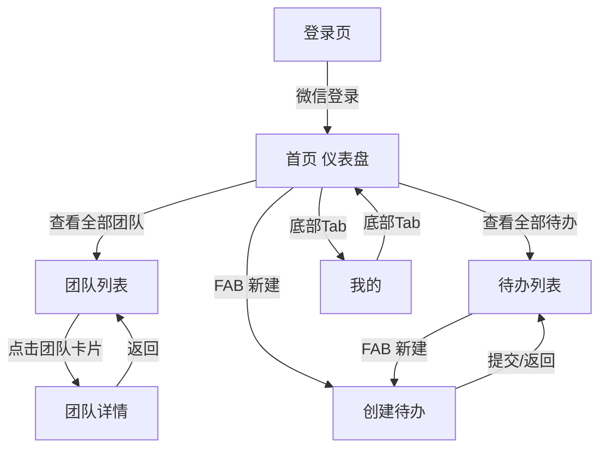
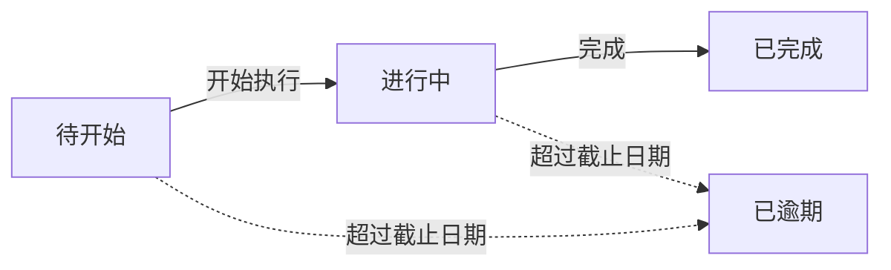

# 团队待办小程序 - 产品需求文档（PRD）

## 1. 产品概述

团队待办是一款面向小型团队协作的微信小程序任务管理应用，以「翡翠绿」为品牌主色，提供清晰的待办跟踪、团队管理和成员协作能力。

- **目标用户**：需要轻量协作的小型团队（5-20 人）的成员与负责人
- **核心价值**：以最小认知负担管理团队待办，提升协作效率，避免信息分散
- **应用形态**：微信小程序（原生开发，WXML/WXSS/JS）

## 2. 核心功能

### 2.1 用户角色

| 角色 | 进入方式 | 核心权限 |
|------|----------|----------|
| 普通成员 | 微信一键登录 | 查看/创建/完成待办、查看所属团队 |
| 团队创建者 | 创建团队后自动获得 | 在所属团队内可邀请成员、管理团队待办 |

> 当前阶段为可运行 Demo，登录采用「模拟微信登录」，数据存于小程序本地缓存（wx.setStorageSync）。

### 2.2 功能模块

1. **登录页**：品牌标识展示、微信一键登录入口、协议同意提示
2. **首页（仪表盘）**：待办统计卡片、我的团队快捷入口、最近待办列表、创建待办 FAB
3. **团队列表**：搜索框、团队卡片列表（含成员数与进行中待办数）、创建团队入口
4. **团队详情**：团队头部信息卡、成员/待办切换 Tab、成员列表、邀请成员按钮
5. **待办列表**：状态筛选 Tab（全部/进行中/待开始/已完成/已逾期）、待办卡片列表、新建 FAB
6. **创建待办**：标题/描述输入、截止日期选择、关联团队选择、指派成员、提交按钮
7. **我的（个人中心）**：用户信息卡、偏好设置（深色模式/主题换肤）、团队管理、关于信息

### 2.3 页面明细

| 页面 | 模块 | 功能描述 |
|------|------|----------|
| 登录页 | 品牌登录卡 | 居中展示 Logo、应用名、Slogan，微信登录按钮，协议链接 |
| 首页 | 统计卡片 | 我的待办/进行中/已完成三栏计数，左侧色条强调 |
| 首页 | 我的团队 | 横向滚动团队卡片，点击进入团队详情，「查看全部」进入列表 |
| 首页 | 最近待办 | 最近 3-5 条待办卡片，含状态点与团队标签 |
| 首页 | FAB | 右下角悬浮新建待办按钮，跳转创建页 |
| 团队列表 | 搜索 | 实时过滤团队名称 |
| 团队列表 | 团队卡片 | 头像、名称、成员数/待办数、左侧品牌色条 |
| 团队详情 | 团队头部 | 渐变背景、头像、名称、简介、统计（成员/待办/已完成） |
| 团队详情 | Tab 切换 | 成员列表 / 团队待办两个 Tab，带下划线指示 |
| 团队详情 | 成员列表 | 头像、姓名、角色徽章（创建者/成员） |
| 待办列表 | 状态筛选 | 横向滚动筛选 Tab，选中态填充品牌色 |
| 待办列表 | 待办卡片 | 圆形勾选、标题、所属团队+指派人、截止日期、状态徽章 |
| 创建待办 | 表单 | 标题/描述输入（下划线风格）、日期选择、团队胶囊选择、成员指派 |
| 我的 | 用户卡片 | 头像、姓名、邮箱，顶部品牌色渐变条 |
| 我的 | 设置列表 | 分组卡片：偏好设置、团队管理、其他（帮助/关于） |

## 3. 核心流程

### 3.1 用户主流程

用户登录后进入首页，可查看个人待办统计与最近待办；通过底部 Tab 切换至团队/待办/我的；在待办列表可筛选状态、点击 FAB 创建新待办；在团队列表可进入团队详情查看成员与待办。

### 3.2 流程图

### 3.3 待办状态流转

## 4. 用户界面设计

### 4.1 设计风格

- **整体风格**：微信小程序原生视觉语言，干净克制的效率工具风格
- **主色**：翡翠绿 `#10b981`（CTA、激活态、勾选）
- **次色**：状态语义色——成功 `#10b981`、警告 `#f59e0b`、错误 `#ef4444`、信息 `#3b82f6`
- **背景层级**：主背景白 `#ffffff`，次背景浅灰 `#f9fafb`，三级背景 `#f3f4f6`
- **文本层级**：主 `#0f172a`、次 `#475569`、三级 `#94a3b8`
- **边框**：`#e5e7eb`（1px 细边优先，静态阴影 alpha ≤ 0.05）
- **字体**：Noto Sans SC / PingFang SC / 系统默认
- **字号体系（rpx）**：22/26/30/34/40/48
- **圆角体系（rpx）**：8/16/24/32，胶囊与头像使用 `9999rpx`
- **按钮**：填充式翡翠绿圆角按钮（高度 96rpx），次要按钮为带边框幽灵样式
- **布局**：移动端 32rpx 水平内边距，列表项 24rpx 间距，卡片优先采用左侧 6rpx 色条强调

### 4.2 页面设计概览

| 页面 | 关键模块 | UI 元素 |
|------|----------|---------|
| 登录页 | 品牌登录卡 | 居中纵向布局、渐变 Logo、绿色 CTA、底部协议 |
| 首页 | 仪表盘 | 三栏统计卡（左色条）、横向团队卡、纵向待办卡 |
| 团队列表 | 卡片列表 | 搜索框、左色条团队卡、右箭头 |
| 团队详情 | 头部+Tab | 渐变头部、Tab 下划线、成员行 |
| 待办列表 | 筛选+列表 | 胶囊筛选 Tab、圆形勾选、状态徽章 |
| 创建待办 | 表单 | 下划线输入、胶囊选择、底部固定提交 |
| 我的 | 卡片+设置组 | 渐变顶条、分组列表、Chevron 箭头 |

### 4.3 多端适配

- **小程序原生**：使用 `rpx` 单位自动适配不同机型屏幕宽度（750rpx = 屏幕宽度）
- **安全区**：底部 Tab Bar 与 FAB 预留 `env(safe-area-inset-bottom)` 适配刘海屏
- **状态栏**：通过 `wx.getSystemInfoSync()` 获取状态栏高度，自定义导航栏适配

### 4.4 交互细节

- 页面切换：使用 `wx.navigateTo` / `wx.switchTab` / `wx.navigateBack`
- 列表项：`:active` 按压反馈
- FAB：固定定位，带阴影上浮
- 表单输入：聚焦时下划线变粗并变品牌色
- 筛选 Tab：选中态填充品牌色，未选中态描边
- 勾选完成：点击圆形勾选触发完成动画并切换状态
