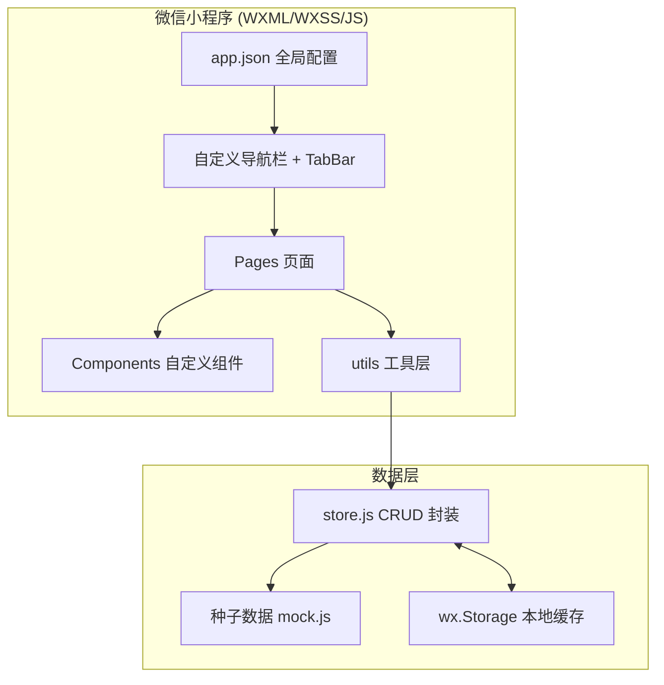

# 团队待办小程序 - 技术架构文档

## 1. 架构设计



## 2. 技术说明

- **平台**：微信小程序原生（不使用框架）
- **语言**：WXML（结构）/ WXSS（样式，含 rpx 响应式单位）/ JavaScript（逻辑）
- **配置**：`app.json` 全局配置，`project.config.json` 工程配置
- **组件**：原生组件 + 自定义组件（`components/` 目录）
- **状态管理**：基于 `wx.setStorageSync` 的本地缓存 + `app.globalData` 全局共享
- **数据来源**：内置 Mock 种子数据（不依赖后端，保证可独立运行）
- **图标**：使用 inline SVG / 字符 / 图片（小程序不支持外部图标字体）
- **appid**：复用现有 `wx83fdff07a06cab30`（体验版/开发者工具可直接预览）

## 3. 页面路由定义

`app.json` 的 `pages` 数组（首个为启动页）：

| 路径 | 页面 | 类型 | 跳转方式 |
|------|------|------|----------|
| `pages/home/home` | 首页 | Tab | switchTab |
| `pages/team-list/team-list` | 团队列表 | Tab | switchTab |
| `pages/todo-list/todo-list` | 待办列表 | Tab | switchTab |
| `pages/profile/profile` | 我的 | Tab | switchTab |
| `pages/login/login` | 登录页 | 普通页 | navigateTo / redirectTo |
| `pages/team-detail/team-detail` | 团队详情 | 普通页 | navigateTo |
| `pages/create-todo/create-todo` | 创建待办 | 普通页 | navigateTo |

`tabBar` 配置 4 个 Tab（首页/团队/待办/我的），未登录用户首次进入会通过 `app.js` 检测登录态并 `redirectTo` 至登录页。

## 4. 数据模型

```javascript
// 用户
const User = {
  id: 'u1',
  name: '张明',
  email: 'zhangming@email.com',
  avatarChar: '我',
  avatarColor: '#10b981'
}

// 团队
const Team = {
  id: 't1',
  name: '产品设计组',
  description: '负责产品UI/UX设计和原型制作',
  avatarChar: '产',
  avatarColor: '#10b981',     // 头像背景色
  accentColor: '#10b981',     // 卡片左色条
  memberCount: 8,
  creatorId: 'u1',
  createdAt: '2025-07-01'
}

// 成员
const Member = {
  id: 'm1',
  teamId: 't1',
  name: '张明',
  avatarChar: '张',
  avatarColor: '#10b981',
  role: 'creator'   // 'creator' | 'member'
}

// 待办
const Todo = {
  id: 'todo1',
  title: '完成首页设计稿',
  description: '',
  teamId: 't1',
  teamName: '产品设计组',
  assigneeId: 'u1',
  assigneeName: '张明',
  dueDate: '2025-07-05',
  status: 'in_progress',  // 'pending' | 'in_progress' | 'completed' | 'overdue'
  createdAt: '2025-07-03',
  createdBy: 'u1'
}
```

### 4.1 种子数据

内置 3 个团队（产品设计组/运营推广组/技术研发组）、6 名成员、5+ 条待办，覆盖全部状态。

## 5. 目录结构

```
miniprogram/
├── app.js                    # 小程序入口，登录态检测
├── app.json                  # 全局配置（页面、TabBar、窗口）
├── app.wxss                  # 全局样式 + 设计令牌 (CSS 变量)
├── sitemap.json
├── components/               # 自定义组件
│   ├── nav-bar/              # 自定义导航栏（标题+返回+胶囊占位）
│   ├── status-badge/         # 状态徽章
│   ├── avatar/               # 头像
│   └── empty-state/          # 空状态
├── pages/
│   ├── home/                 # 首页（仪表盘）
│   ├── team-list/            # 团队列表
│   ├── team-detail/          # 团队详情
│   ├── todo-list/            # 待办列表
│   ├── create-todo/          # 创建待办
│   ├── profile/              # 我的
│   └── login/                # 登录
└── utils/
    ├── store.js              # 数据 CRUD + Storage 持久化
    ├── mock.js               # 种子数据
    ├── auth.js               # 登录态管理
    └── date.js               # 日期格式化工具
```

每个页面目录包含 4 个同名文件：`.wxml` / `.wxss` / `.js` / `.json`

## 6. Design Tokens（app.wxss 全局变量）

```css
page {
  /* 品牌色 */
  --color-brand: #10b981;
  --color-brand-light: #34d399;
  --color-brand-lightest: #d1fae5;
  --color-brand-dark: #059669;

  /* 状态色 */
  --state-success: #10b981;
  --state-warning: #f59e0b;
  --state-error: #ef4444;
  --state-info: #3b82f6;

  /* 灰阶 */
  --color-gray-100: #f3f4f6;
  --color-gray-200: #e5e7eb;
  --color-gray-300: #d1d5db;
  --color-gray-400: #9ca3af;

  /* 背景 */
  --bg-primary: #ffffff;
  --bg-secondary: #f9fafb;
  --bg-tertiary: #f3f4f6;

  /* 文本 */
  --text-primary: #0f172a;
  --text-secondary: #475569;
  --text-tertiary: #94a3b8;
  --text-inverse: #ffffff;

  /* 边框 */
  --border-light: #e5e7eb;
  --border-default: #d1d5db;

  /* 圆角 */
  --radius-sm: 8rpx;
  --radius-md: 16rpx;
  --radius-lg: 24rpx;
  --radius-xl: 32rpx;
  --radius-full: 9999rpx;

  /* 阴影 */
  --shadow-sm: 0 2rpx 4rpx rgba(0,0,0,0.04);
  --shadow-md: 0 4rpx 16rpx rgba(0,0,0,0.05);
  --shadow-lg: 0 8rpx 24rpx rgba(0,0,0,0.10);
  --shadow-elevated: 0 12rpx 32rpx rgba(16,185,129,0.30);
}
```

## 7. 关键实现要点

### 7.1 自定义导航栏

由于设计稿采用小程序原生导航栏外观（标题居中、右侧胶囊、子页带返回箭头），采用两种方案结合：
- **Tab 页面**：使用 `app.json` 的 `window` 默认导航栏配置（统一标题与背景色）
- **子页面**：在页面 `.json` 中设置 `"navigationStyle": "custom"`，自定义导航栏，通过 `wx.getSystemInfoSync()` 获取状态栏高度适配

### 7.2 TabBar 配置

`app.json` 中 `tabBar` 配置 4 个 Tab，使用 PNG 图标（放 `miniprogram/assets/tabbar/` 目录），选中态翡翠绿，未选中态灰。

### 7.3 数据持久化

- `utils/store.js` 封装 CRUD，内部使用 `wx.getStorageSync('todos')` / `wx.setStorageSync`
- 首次启动时若 Storage 为空，从 `mock.js` 写入种子数据
- 创建/更新/删除操作后同步写入 Storage，并通过页面 `onShow` 重新加载

### 7.4 登录态

- `app.js` 的 `onLaunch` 检查 `wx.getStorageSync('user')`
- 未登录则记录目标 Tab，首页 `onShow` 中 `wx.redirectTo` 到登录页
- 登录页点击「微信一键登录」后写入 user 信息并 `wx.switchTab` 到首页

### 7.5 待办状态计算

- 创建时默认 `pending`
- 提供「开始」按钮：`pending -> in_progress`
- 提供圆形勾选：`in_progress -> completed`，再次点击恢复
- 列表展示时若 `dueDate < today && status !== completed`，标记为 `overdue`（仅展示，不修改存储状态）

## 8. 多端适配验证

| 端 | 适配方式 |
|----|----------|
| iPhone（含刘海） | rpx 自动适配 + safe-area-inset-bottom |
| Android | rpx 自动适配 |
| iPad 小程序 | rpx 自动适配，TabBar 居底 |
| 微信开发者工具 | 直接预览调试 |
