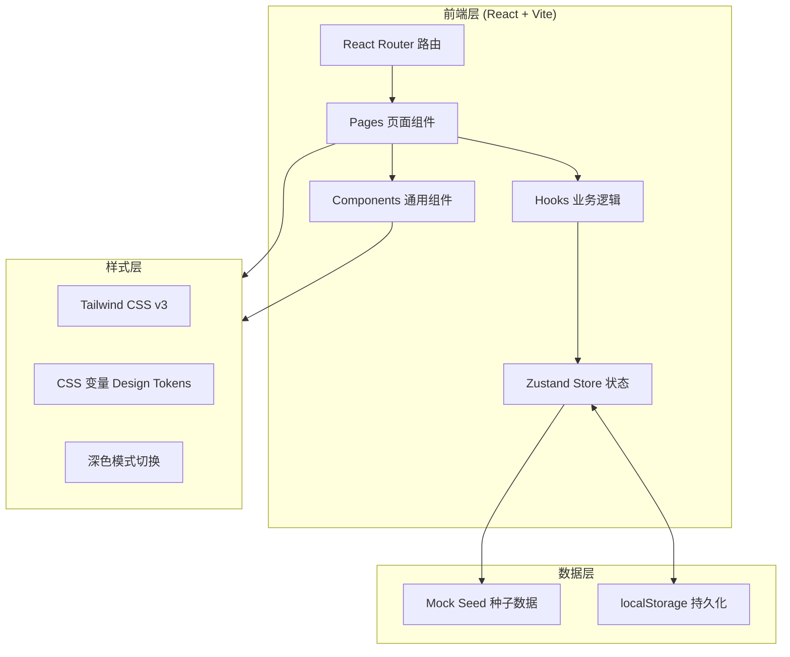

# 团队待办小程序 - 技术架构文档

## 1. 架构设计



## 2. 技术说明

- **前端框架**：React 18 + TypeScript
- **构建工具**：Vite 5
- **路由**：react-router-dom v6
- **样式方案**：Tailwind CSS v3 + CSS 变量（实现深色模式与主题换肤）
- **状态管理**：Zustand（轻量、API 简洁）
- **图标**：lucide-react
- **持久化**：localStorage（保存用户登录态、待办与团队数据）
- **后端**：无（前端 Demo，使用内置 Mock 数据）
- **包管理器**：pnpm（若环境可用），否则 npm

## 3. 路由定义

| 路由 | 页面 | 说明 |
|------|------|------|
| `/login` | 登录页 | 未登录跳转目标 |
| `/` | 首页 | 登录后默认页，仪表盘 |
| `/teams` | 团队列表 | Tab「团队」对应页 |
| `/teams/:id` | 团队详情 | 子页，需团队 ID |
| `/todos` | 待办列表 | Tab「待办」对应页 |
| `/todos/new` | 创建待办 | 子页，从 FAB 进入 |
| `/profile` | 我的 | Tab「我的」对应页 |

路由守卫：未登录用户访问除 `/login` 外的页面将被重定向至 `/login`。

## 4. 数据模型

### 4.1 实体定义

```typescript
// 用户
interface User {
  id: string;
  name: string;
  email: string;
  avatarColor: string;   // 头像背景色
  avatarChar: string;    // 头像首字
}

// 团队
interface Team {
  id: string;
  name: string;
  description: string;
  avatarChar: string;
  avatarColor: string;       // 头像背景色
  accentColor: string;       // 卡片左色条颜色
  memberCount: number;
  createdAt: string;
  creatorId: string;
}

// 成员关系
interface TeamMember {
  id: string;
  teamId: string;
  userId: string;
  name: string;
  avatarChar: string;
  avatarColor: string;
  role: 'creator' | 'member';
}

// 待办
interface Todo {
  id: string;
  title: string;
  description?: string;
  teamId: string;
  teamName: string;
  assigneeId: string;
  assigneeName: string;
  dueDate: string;           // ISO 日期
  status: 'pending' | 'in_progress' | 'completed' | 'overdue';
  createdAt: string;
  createdBy: string;
}
```

### 4.2 种子数据

内置 3 个团队（产品设计组、运营推广组、技术研发组）、6 名成员、5+ 条待办，覆盖所有状态。

## 5. 目录结构

```
src/
├── components/              # 通用组件
│   ├── MiniProgramNav.tsx   # 小程序顶部导航栏（含返回/胶囊）
│   ├── TabBar.tsx           # 底部 4 Tab 导航
│   ├── Fab.tsx              # 悬浮新建按钮
│   ├── StatusBadge.tsx      # 状态徽章
│   ├── Avatar.tsx           # 头像
│   └── PageTransition.tsx   # 页面过渡包装
├── pages/                   # 页面
│   ├── Login.tsx
│   ├── Home.tsx
│   ├── TeamList.tsx
│   ├── TeamDetail.tsx
│   ├── TodoList.tsx
│   ├── CreateTodo.tsx
│   └── Profile.tsx
├── store/                   # Zustand 状态
│   ├── authStore.ts
│   ├── teamStore.ts
│   ├── todoStore.ts
│   └── settingsStore.ts
├── data/                    # 种子数据
│   └── seed.ts
├── types/                   # TS 类型
│   └── index.ts
├── hooks/                   # 自定义 Hooks
│   └── useFilteredTodos.ts
├── utils/                   # 工具函数
│   ├── date.ts
│   └── status.ts
├── styles/                  # 全局样式
│   ├── tokens.css           # Design Tokens (CSS 变量)
│   └── global.css           # 全局样式与 Tailwind 入口
├── App.tsx                  # 路由与布局
├── main.tsx                 # 入口
└── index.html               # HTML 模板
```

## 6. Design Tokens 设计

通过 CSS 变量集中管理设计令牌，深色模式通过 `:root.dark` 覆写：

```css
:root {
  /* 品牌色 */
  --color-brand: #10b981;
  --color-brand-light: #34d399;
  --color-brand-lighter: #6ee7b7;
  --color-brand-lightest: #d1fae5;
  --color-brand-dark: #059669;
  --color-brand-darker: #047857;

  /* 状态色 */
  --state-success: #10b981;
  --state-warning: #f59e0b;
  --state-error: #ef4444;
  --state-info: #3b82f6;

  /* 灰阶 */
  --color-gray-100: #f3f4f6;
  --color-gray-200: #e5e7eb;
  --color-gray-300: #d1d5db;
  --color-gray-400: #9ca3af;

  /* 背景 */
  --bg-primary: #ffffff;
  --bg-secondary: #f9fafb;
  --bg-tertiary: #f3f4f6;

  /* 文本 */
  --text-primary: #0f172a;
  --text-secondary: #475569;
  --text-tertiary: #94a3b8;
  --text-inverse: #ffffff;

  /* 边框 */
  --border-light: #e5e7eb;
  --border-default: #d1d5db;

  /* 圆角 */
  --radius-sm: 4px;
  --radius-md: 8px;
  --radius-lg: 12px;
  --radius-xl: 16px;
  --radius-full: 9999px;

  /* 阴影 */
  --shadow-sm: 0 1px 2px rgba(0,0,0,0.04);
  --shadow-md: 0 2px 8px rgba(0,0,0,0.05);
  --shadow-lg: 0 4px 12px rgba(0,0,0,0.10);
  --shadow-elevated: 0 6px 16px rgba(16,185,129,0.30);

  /* 控件 */
  --control-height: 40px;
  --control-height-lg: 48px;

  /* 字号 */
  --text-xs: 11px;
  --text-sm: 13px;
  --text-base: 15px;
  --text-lg: 17px;
  --text-xl: 20px;
  --text-2xl: 24px;

  /* 字体 */
  --font-family: 'Noto Sans SC', -apple-system, BlinkMacSystemFont, 'PingFang SC', 'Microsoft YaHei', sans-serif;
}

:root.dark {
  --bg-primary: #0f172a;
  --bg-secondary: #111827;
  --bg-tertiary: #1f2937;
  --text-primary: #f1f5f9;
  --text-secondary: #cbd5e1;
  --text-tertiary: #64748b;
  --border-light: #1f2937;
  --border-default: #374151;
  /* 品牌色保持，但稍亮以适配深色背景 */
  --color-brand-lightest: #064e3b;
}
```

## 7. 关键实现要点

### 7.1 移动端容器

- 在 `App.tsx` 外层包裹 `max-w-[480px] mx-auto` 容器
- 桌面浏览器查看时，容器居中，背景为浅灰，营造手机预览效果
- 移动端浏览器全屏展示

### 7.2 小程序导航栏复用

`MiniProgramNav` 组件支持：
- `title`：标题
- `showBack`：是否显示返回按钮（子页面为 true，Tab 页为 false）
- `rightSlot`：右侧操作区（如「创建团队」按钮）
- 顶部状态栏占位 44px + 导航栏 44px

### 7.3 Tab Bar

- 固定底部，4 个 Tab
- 通过 `useLocation` 判断当前激活 Tab
- 点击使用 `navigate` 跳转
- 底部预留 `safe-area-inset-bottom`

### 7.4 状态管理与持久化

- `authStore`：登录状态、当前用户
- `teamStore`：团队列表、当前团队
- `todoStore`：待办列表、筛选状态、CRUD 操作
- `settingsStore`：深色模式开关
- 通过 Zustand `persist` 中间件持久化到 localStorage

### 7.5 待办状态自动计算

- 创建时默认 `pending`
- 提供手动切换 `pending <-> in_progress <-> completed`
- 「已逾期」状态由 `dueDate < today && status !== completed` 计算得出，不持久化

## 8. 多端适配验证

| 端 | 视口 | 表现 |
|----|------|------|
| 移动浏览器 | 375px | 全屏原生小程序观感 |
| 平板 | 768px | 内容居中 480px，两侧留白 |
| 桌面浏览器 | ≥ 1024px | 内容居中 480px，模拟手机壳 |
| PWA | - | 可添加到主屏幕，独立窗口 |
